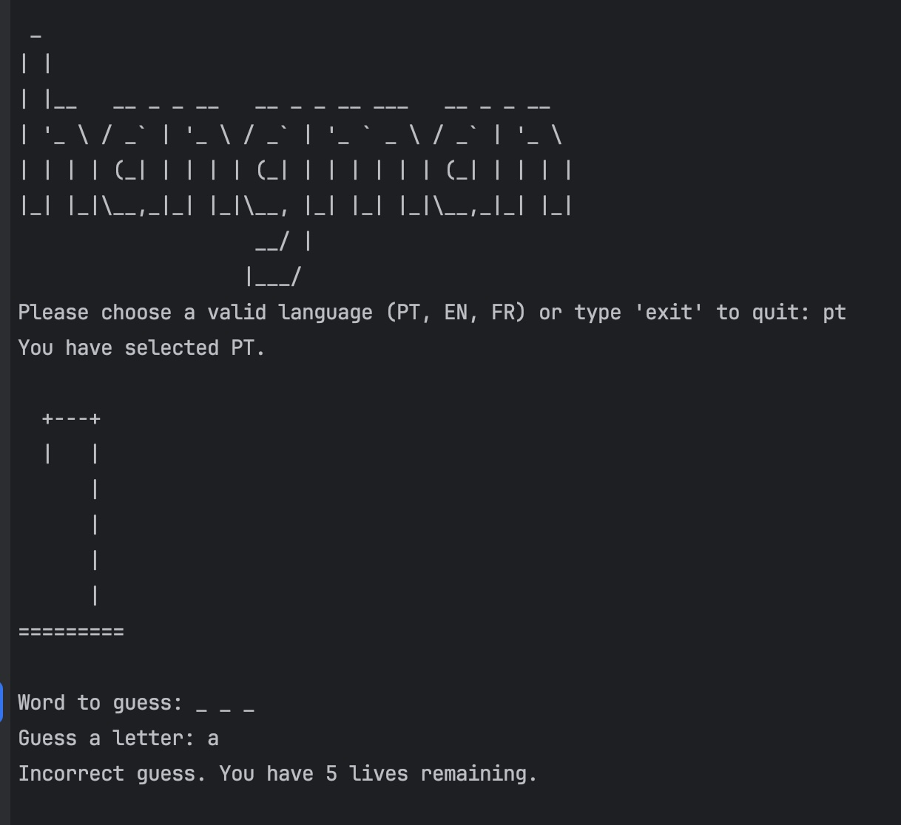

# Hangman Game

## Overview

This is an interactive Hangman game implemented in Python. Players can choose from three different languages (Portuguese, English, and French) and guess letters to uncover a hidden word.

## Features

- Supports three languages: Portuguese (PT), English (EN), and French (FR).
- Interactive console game with visual stages representing lives remaining.
- Validates user input for language selection and letter guesses.

## How to Play

1. Run the script.
2. Choose a valid language by entering **PT**, **EN**, or **FR**. Type **exit** to quit.
3. The game will present a hidden word represented by underscores.
4. Enter one letter at a time to guess the word.
5. You have a limited number of lives; each incorrect guess reduces your lives.
6. The game ends when you either guess the word or run out of lives.

