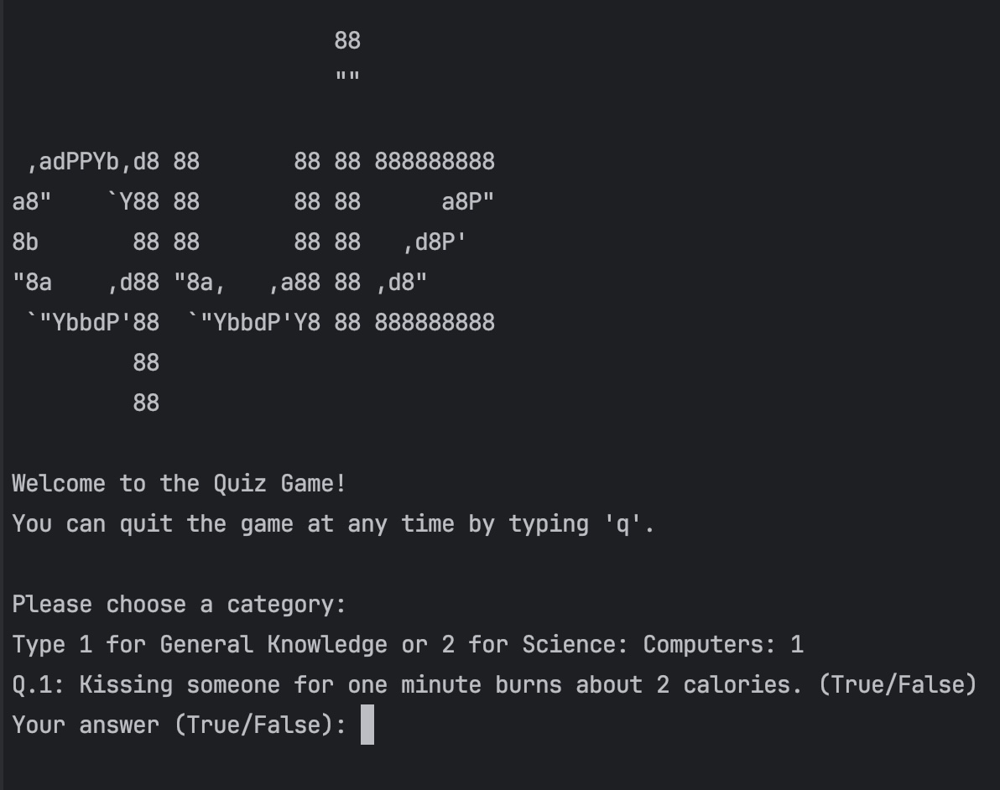

# Quiz Game

## Overview

This project implements a command-line quiz game where users can test their knowledge in different categories, such as General Knowledge and Science & Computers. The game provides multiple-choice questions and keeps track of the user's score throughout the quiz.

## Features

- Multiple categories to choose from.
- User-friendly interface with a welcome message and instructions.
- Ability to quit the game at any time by typing 'q'.
- Tracks the user's score and displays it at the end of the quiz.

## How to Use

1. Run the script.
2. Choose a category by entering the corresponding number:
   - 1: General Knowledge
   - 2: Science & Computers
3. Answer the questions presented in the quiz by typing your answer.
4. Type 'q' to quit the game at any time.
5. At the end of the quiz, your score will be displayed.

## Example

